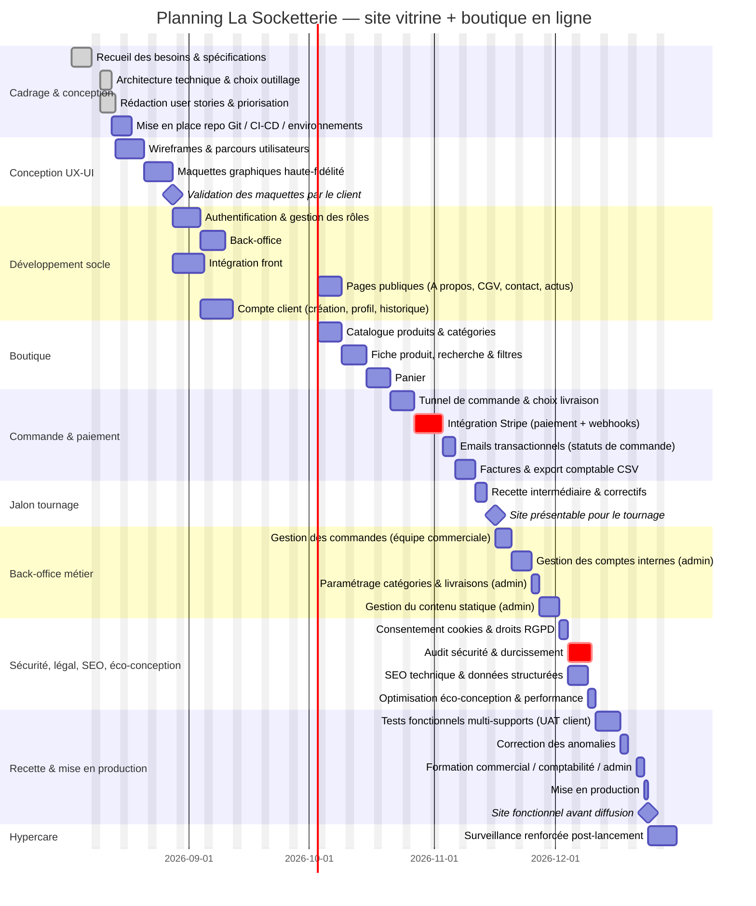

# 4. Diagramme de Gantt

Toutes les durées sont exprimées **en jours ouvrés** (week-ends exclus). Date de démarrage retenue à titre d'exemple : lundi 03/08/2026 (à ajuster selon la date réelle de lancement). Deux jalons contractuels structurent le planning :

- **Jalon M1 — "Site présentable"** : vers le jour ouvré 59 (~12 semaines), avec une marge de sécurité avant la limite des 3 mois fixée par le tournage.
- **Jalon M2 — "Site fonctionnel et testé"** : vers le jour ouvré 87 (~17,5 semaines), avant la limite des 4 mois fixée par la diffusion du reportage, suivi d'une semaine d'hypercare.

## Répartition des ressources par lot

| Lot | Ressource principale | Appui |
|---|---|---|
| Cadrage & conception | Moi (full-stack, pilotage) | Directeur (validations à distance) |
| UX/UI | Jack, Rose | Directeur (validation client) |
| Développement socle | Jonathan (back), David (front) | Moi (architecture, revue de code) |
| Boutique | David (front), Jonathan (back) | Moi |
| Commande & paiement | Moi + **Omar (freelance, 5 j max)** sur l'intégration Stripe | Jonathan |
| Back-office métier | Jonathan (back), David (front) | Moi |
| Sécurité / SEO / éco-conception | Moi + **Fred (freelance, 5 j max)** sur l'audit sécurité | Jonathan, David |
| Recette & mise en production | Toute l'équipe | Directeur (recette client / UAT) |
| Hypercare | Moi, Jonathan | — |

Le Lead Developer, absent les 3 premières semaines, est prévu en revue d'architecture et validation ponctuelle à son retour (non représenté comme une ligne dédiée dans le planning ci-dessus, car transverse).
